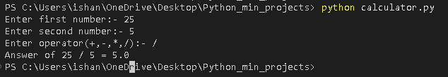

# Python Mini Calculator

A simple command-line calculator built with Python.

## Features
- Addition
- Subtraction
- Multiplication
- Division
- Handles invalid operators
- Prevents division by zero

## Concepts Used
- Functions
- if-elif-else
- User input
- Return statements

## How to Run

```bash
python calculator.py
```
## Demo


