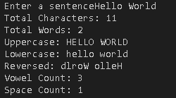

# Text Analyzer 📝

A command-line Python program that analyzes a sentence and provides useful information about it.

## Features

- Counts total characters
- Counts total words
- Converts text to uppercase
- Converts text to lowercase
- Reverses the sentence
- Counts vowels
- Counts spaces

## Concepts Used

- Functions
- String methods
- `len()`
- `split()`
- `count()`
- String slicing
- User input
- Return statements

## Example

```
Enter a sentence: Hello World

Total Characters: 11
Total Words: 2
Uppercase: HELLO WORLD
Lowercase: hello world
Reversed: dlroW olleH
Vowel Count: 3
Space Count: 1
```

## How to Run

```bash
python text_analyzer.py
```

## Screenshot


