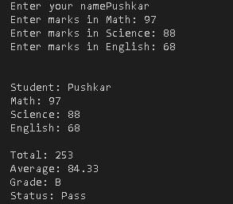

# 🎓 Student Result System

A beginner-friendly Python project that calculates a student's total marks, average, grade, and pass/fail status based on marks entered for three subjects.

## ✨ Features

* Accepts the student's name.
* Accepts marks for Math, Science, and English.
* Validates that marks are between **0 and 100**.
* Calculates the total marks.
* Calculates the average marks.
* Assigns a grade based on the average.
* Displays whether the student has **Passed** or **Failed**.

## 🛠️ Concepts Used

* Python Functions
* User Input (`input()`)
* Conditional Statements (`if`, `elif`, `else`)
* Arithmetic Operators
* Variables
* Return Statements
* f-Strings

## 📸 Screenshot



## 📋 Grading Criteria

| Average Marks | Grade |
| ------------: | :---: |
|      90 – 100 |   A   |
|       80 – 89 |   B   |
|       70 – 79 |   C   |
|       60 – 69 |   D   |
|      Below 60 |   F   |

A student is considered **Pass** if the average marks are **60 or above**.

## ▶️ How to Run

1. Clone this repository.
2. Open the project in Python.
3. Run the Python file.
4. Enter the student's name and marks when prompted.
5. View the generated result.

## 📌 Sample Output

```text
Enter your name: Pushkar
Enter marks in Math: 90
Enter marks in Science: 85
Enter marks in English: 78


Student: Pushkar
Math: 90
Science: 85
English: 78

Total: 253
Average: 84.33
Grade: B
Status: Pass
```

## 🚀 Future Improvements

* Support multiple students.
* Store records using files.
* Add subject-wise pass/fail validation.
* Display ranks and toppers.
* Build a menu-driven version.

---

This project was created as part of my Python learning journey using beginner-level Python concepts.
