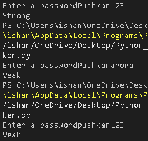

# 🔐 Password Strength Checker

A beginner-friendly Python project that checks whether a password meets basic strength requirements.

## 📌 Description

This project checks whether a password satisfies three basic requirements:

* At least **8 characters**
* At least **one uppercase letter**
* At least **one digit**

If all three requirements are met, the program returns **Strong**. Otherwise, it returns **Weak**.

This project was built as part of my Python practice while learning programming fundamentals.

## 🛠️ Concepts Used

* Python functions
* `if/else` statements
* `for` loops
* User input
* Boolean variables (flags)
* String methods
* `len()`
* `.isupper()`
* `.isdigit()`

## ▶️ Example

### Strong Password

```text
Enter a password: Hello123
Strong
```

### Weak Password

```text
Enter a password: hello
Weak
```

## 📸 Screenshot



## 🚀 How to Run

Make sure Python is installed on your computer.

Clone or download this repository, open the project folder in a terminal, and run:

```bash
python password_strength_checker.py
```

Then enter a password when prompted.

## 📂 Files

```text
Password-Strength-Checker/
│
├── password_strength_checker.py
├── password_strength_checker.png
└── README.md
```

## 📚 Learning Goal

The goal of this project was to practice combining **functions, loops, conditionals, string methods, and Boolean flags** into a small working Python project.

## 👨‍💻 Author

Built as part of my ongoing Python programming practice.
