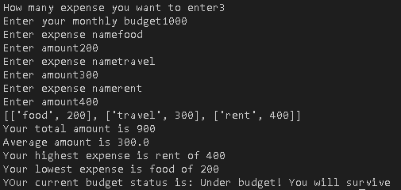

# Expense Tracker

A simple Python expense tracker that allows users to enter expenses, calculate total and average spending, identify the highest and lowest expenses, and check spending against a monthly budget.

## Features

- Enter multiple expenses
- Store expense names and amounts
- Calculate total expenses
- Calculate average expense
- Find the highest expense
- Find the lowest expense
- Compare total spending with a monthly budget
- Display the current budget status

## Concepts Practiced

- Variables
- User input
- `if`, `elif`, and `else`
- `for` loops
- Functions
- Lists
- Nested lists
- List indexing
- `.append()`
- Returning multiple values
- Arithmetic operations
- f-strings

## How to Run

1. Make sure Python is installed.
2. Clone or download this repository.
3. Open a terminal in the project folder.
4. Run:

```bash
python expense_tracker.py
```

## Screenshot



