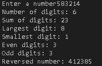

# 🔢 Number Analyzer

A simple Python program that analyzes the digits of a given number.

The program calculates:

- Number of digits
- Sum of digits
- Largest digit
- Smallest digit
- Number of even digits
- Number of odd digits
- Reversed number

## 📸 Output



## 🚀 How It Works

The program uses Python fundamentals such as:

- `while` loops
- `if/else` statements
- Functions
- Modulo operator `%`
- Integer division `//`
- Variables and arithmetic operations

Each analysis is handled by a separate function, making the program easier to understand and maintain.

## 💻 Example

```text
Enter a number: 583214

Number: 583214
Number of digits: 6
Sum of digits: 23
Largest digit: 8
Smallest digit: 1
Even digits: 3
Odd digits: 3
Reversed number: 412385
